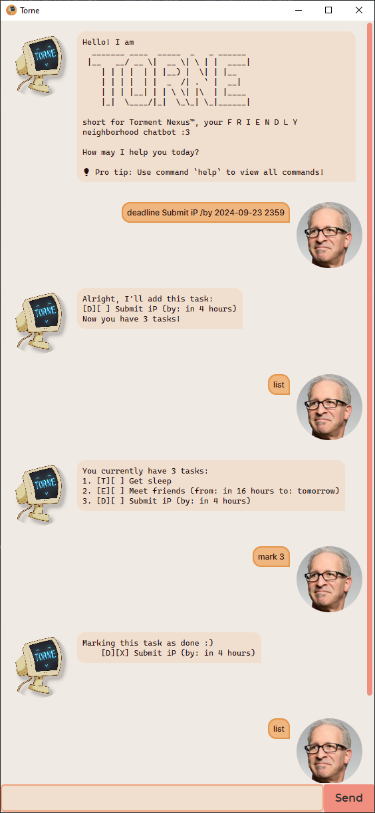

# Torne User Guide



_Torne_ is a chatbot. It does stuff. Mostly tasks. Does have persistent storage though, I guess that's cool.

## Main Commands

Note: all commands are case-sensitive. They are to be input in **all-lowercase**.

### Help

Shows all commands, a brief description, and their options.

Run: `help`

### Exit

Exits the application.

Run: `exit`

### List

Shows all current tasks.

Run: `list`

Each task is output with the following format:

```plain
[<type>][<completion-status>] <name> (<date/time-information>)
```

Example output:

```plain
You currently have 3 tasks:
1. [T][ ] Get sleep
2. [E][ ] Meet friends (from: in 16 hours to: tomorrow)
3. [D][X] Submit iP (by: in 4 hours)
```

### Find

Finds all tasks matching the given substring.

- Whitespace within the substring is preserved.
- Searches are **non-case-sensitive**.

Example: `find sleep`

Output:

```plain
Your search for 'sleep' returned the following tasks:
1. [T][ ] Get sleep
```

## Task Commands - Add

- Task adding commands are all of the format `cmd <name> [options...]`. Adding a name is required.
- All date/time inputs are of the format `yyyy-MM-dd HHmm`. For instance, `1970-01-01 2359`.

### Todo Tasks

**Todo** tasks are tasks without any associated date/time information.

Example: `todo fry an egg`

Output:

```plain
Alright, I'll add this task:
[T][ ] fry an egg
Now you have 2 tasks!
```

### Deadline Tasks

**Deadline** tasks are tasks without 1 date/time to represent when the task should be completed by.

Example: `deadline meet friends /by 2024-09-28 1200`

Output:

```plain
Alright, I'll add this task:
[D][ ] meet friends (by: in 4 days)
Now you have 2 tasks!
```

### Event Tasks

**Deadline** tasks are tasks with 1 date/time's to represent when the start and end date of the event task.

Example: `event survive /from 2024-09-28 1200 /to 2025-12-31 2359`

Output:

```plain
Alright, I'll add this task:
[E][ ] survive (from: in 4 days to: in 1 year)
Now you have 2 tasks!
```

## Task Commands - Modify

Modify tasks. If the command calls for an index, the index is 1-indexed (not 0-indexed) and corresponds to the index
shown if you run the `list` command.

### Mark/Unmark as Done

Mark or unmark a particular task as complete. Takes in the index of the task.

example: `mark 1` or `unmark 2`

### Delete

Deletes a task. Takes in the index of the task.

example: `delete 1`

## Notes

### Saving of User Task Data

User task data is saved after every command input.

### Console Output

If the application is run via the command-line, i.e. via `java -jar torne.jar`, the same responses output to the GUI are
duplicated in the terminal window as well.
